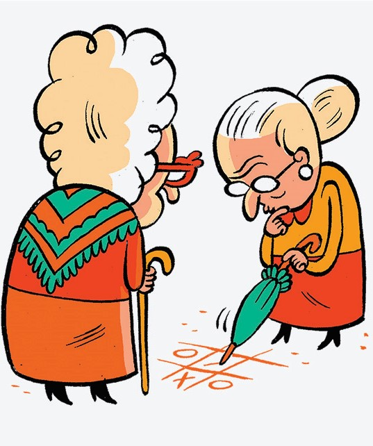

<p align="center"></img></p>
<h1 align="center">JogoDaVelha</h1>
<p align="center">O projeto consiste na criação de um pequeno jogo da velha</p>

<p align="center">
  <a aria-label="HTML" href="https://developer.mozilla.org/pt-BR/docs/Web/HTML">
      </img>
    </a>
   <a aria-label="CSS" href="https://developer.mozilla.org/pt-BR/docs/Web/CSS">
    </img>
  </a>
  
   <a aria-label="JAVASCRIPT" href="https://developer.mozilla.org/pt-BR/docs/Aprender/JavaScript">
    </img>
  </a>

  </p>

  # Instalação 
  Para iniciar o **JogoDaVelha** você vai clona o projeto em seu computador e em seguida execute:

```bash
cd Jogo-Da-Velha

clique no index.html
```

## Construido com:
* [Html](https://developer.mozilla.org/pt-BR/docs/Web/HTML)  
* [Css](https://developer.mozilla.org/pt-BR/docs/Web/CSS)
* [javascript](https://developer.mozilla.org/pt-BR/docs/Aprender/JavaScript) 

</br>

## Autor
**Djayson Rodrigues** - [LinkedIn](https://br.linkedin.com/in/djaysonrodrigues)

</br>

